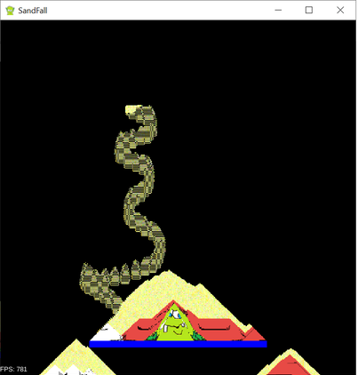

# SandFall

Demonstrator of a falling sand effect using compute shaders.

Requires GLES 3.1.

Controls:
- mouse drag to add sand
- SPACE to freeze animation
- S to single-step when frozen
- R to reset

## How does it work?
Two textures are used as input buffer and output buffer for a compute shader.  
The compute shader executes a falling sand algorithm on each pixel from the input buffer
and writes the result to the output buffer.  
As this is a compute shader, the GPU runs the calculation for each pixel in parallel.

Black pixels are considered empty and coloured pixels will seem to fall in the empty space.
The compute shader (see: sandfall.cs.glsl) is coded in GLSL and acts as a cellular automaton.
To avoid racing conditions, each shader instantiation will only write to its own pixel position.
For example: if a pixel is empty (black) and the pixel above is not (another colour), then the 
output pixel will take the colour from the above pixel to simulate the colour dropping down.
Meanwhile, the shader for the pixel above detects it has a colour and the cell below is empty,
so it will output an empty colour.

Pixels that are pure blue are consider immovable.

## Since when can we use compute shaders in LibGDX?
Since [LibGDX 1.12.0](https://libgdx.com/news/2023/07/gdx-1-12), the desktop version (lwjgl3 module) supports GL31 and GL32.  This unlocks the following GL functions which are important to work with compute shaders:

        gl.glBindImageTexture(unit, texture, level, isLayered, layer, access, format);
This binds a texture to an image unit for the purpose of reading and writing it from shaders. The function call indicates the pixel format of the texture, e.g. RGBA8, and if it is read-only or write-only.  The texture does not have to correspond to an image, you could use it as a 2d matrix of floating point values.

        gl.glDispatchCompute(nx, ny, nz);
This launches one or more compute work groups.  The number of work groups are defined for each of three dimensions.  Work groups are executed completely independently.  Within a work group you can have multiple shader invocations.  Shader invocations in the same work group can make use of shared memory.  Sharing memory between different work groups is much more difficult.  The number of shader invocations per work group (again: in 3 dimensions) is defined by the local_size specification in the shader code. 

        gl.glMemoryBarrier(bitflag);
This defines a barrier ordering the memory transactions issued prior to the command relative to those issued after the barrier.  In our case, it is used to synchronize access to the output texture between GPU and CPU, forcing the CPU to wait until all GPU shader invocations have finished writing to the output texture.

The above is sufficient to get started with compute shaders.  You will need to get you hands dirty to use some GL commands directly, because LibGDX's ShaderProgram for the moment only supports vertex shaders and fragment shaders.

Note that GL31 is only supported by Desktop (LWJGL3), not by Android, IOS or HTML platforms.

## How to create and execute compute shaders
In the demo code the `createShader` method is used to set up the compute shader. This compiles the shader source code that is read from a file. It is very similar to the LibGDX code for ShaderProgram#loadShader.

One additional trick is that it acts as a preprocessor, replacing the line  `#pragma {{DEFINES}}` in the shader source with a sequence of `#define` statements.  If you are used to working with shaders in LibGDX, it is a bit similar how the default shader generates a prefix string filled with #define statements which is put in front of the shader source.

The method `createIterationProgram` in the demo code creates a shader program, compiles the shader using the above method, and links the shader (similar to the code of ShaderProgram#createProgram and ShaderProgram#linkProgram in LibGDX).  Most of the method is due to some hoops it has to jump through to check for link errors.

To then call the compute shader from the render loop, the method `computeNextState` does the following steps:
-	Use glUseProgram to bind the compute shader program
-	Set the u_step uniform which keeps a counter of the steps performed.
-	Use glBindImageTexture() to bind the input and output textures
-	Use glDispatchCompute to launch the compute shader
-	Use glMemoryBarrier to wait for it to finish.

## More about compute shaders
Compute shaders are not part of the rendering pipeline and they are not limited to working on images.  They are suitable for any type of computing to be run in parallel. You can define the number of work groups for the compute shader to use in each of three dimensions. And you can define the size of each work group in terms of shader invocations per X, Y and Z dimension. See the references for more explanation.

Interesting applications of compute shaders are where computations lend themselves naturally to massive parallelization, some ideas that spring to mind:
-	Cellular automata, e.g. Conway’s game of life, falling sand
-	Fractal, e.g. Mandelbrot generator
-	Procedural terrain generation of height fields, e.g. Perlin noise with fBM, landmass erosion
-	Gaussian image blurring
-	Ray tracing
-	Simulating fluids

## References:

- [learnopengl: Compute Shaders](https://learnopengl.com/Guest-Articles/2022/Compute-Shaders/Introduction)

- [Sebastian Lague on compute shaders (not GLSL)](https://www.youtube.com/watch?v=9RHGLZLUuwc&t=32s)  

## Platforms

- `core`: Main module with the application logic shared by all platforms.
- `lwjgl3`: Primary desktop platform using LWJGL3.
